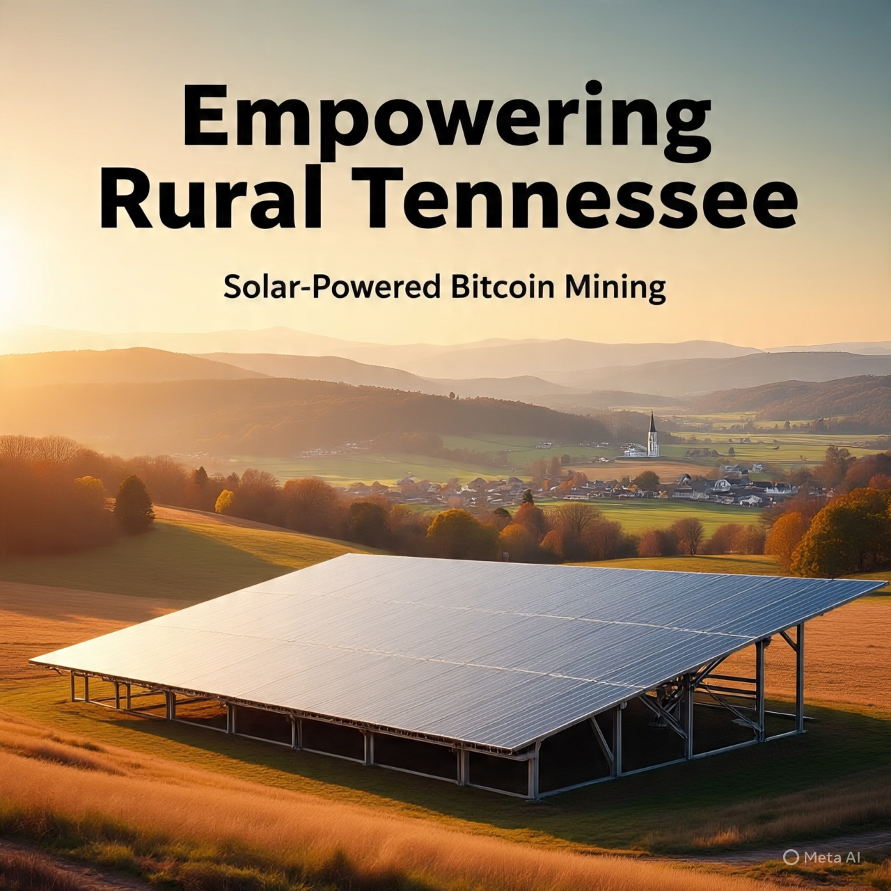
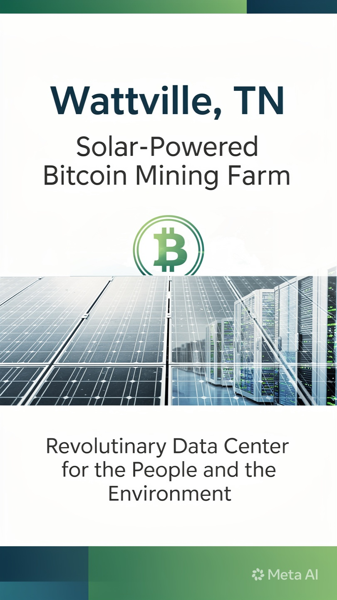
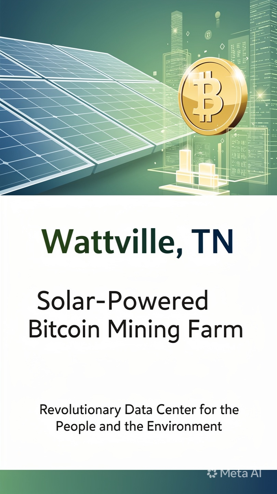

# Wattville, TN

## What:

### Solar Powered Data Center

## Why:

### To Enrich the Living and Economic Experiences in Whiteville, TN

## How:

### Utilize Affordable Renewable Energy to Power Compute Infrastructure for Profitable Bitcoin Mining that Grows the Business and is Reinvested into the Community

[## Building a Circular Bitcoin Economy with Solar Powered Immersion Cooled Mining Farms in Rural TN]::

## Outline:

This, and the included documents and resources, are an outline for the establishment of a renaissance in lifestyle, economy, and overall ecosystem of small town life in West Tennessee.

By investing in renewable energy and utilizing modern technological resources, new avenues of running businesses, supporting your family, and even entertainment are possible. Relying on old structures and processess has lead to severe brain drain and impoverishment for several decades. The time is now to set a course for a better future.

### Components

#### Bitcoin Standard
    
- Company's Primary Monetary Standard. Dollar-based accounting will be used where necessary.
    
- Bitcoin will be the primary savings and preferred commercial money.

- Wattville will provide resources, support, and opportunity to enable community members to opt into living more on a Bitcoin Standard than a USD Standard.

#### Bitcoin Mining

Info

- The primary compute load, the work that the computers are doing, for the Data Center.

- Mining computers will operate by solar/battery power to not burden the existing grid and to reduce any required approvals.

- The upfront cost of equipment will be offset by ongoing bills and changing rates from the grid.

- The data gained from running off-grid can be used to provide a plan to connect to the grid to sell power/stable load at a later date.

- The mining business can also generate income from customers by hosting and maintaining their miners. Customers pay for upkeep and maintance of their miners and get the benefit of owning the equipment and any assets generated by their equipment.

Resources

To learn more about Mining Businesses, see the links below:

[Competitive Analysis](./Analysis.md)

[Miners for Varying Price Points](./Scope.md)

[Potential Phase Buildouts](./Phases.md)

#### Power

Info

- Renewable Energy Generation and Monetization

- Run on Solar and Battery Power

- Model for Wealth Management and Circular Economy

- Profits will sustain long term investments in additional businesses and the community

Resources

For a full breakdown on the Solar System setup and specs refer to the Power Details below.

[Solar System Details](./Power.md)

#### Community Enrichment 

- Business Innovation: Online, Smart, Tech-Enabled

- Personal and Business Server Colocation Services for AI/Media/Storage

- Build Family Friendly Ecosystem - Event Space, Lifestyle Services (Gym/Sauna)

Education

- Regular Workshops, Dedicated STEM Environment and Courses/Resources

- 21st Century Financial Literacy for ALL

- Restore Allen White High School to a Historic Site

- Financial Literacy (Assets, Monies, Strategy) Workshops and Resources

[Details](./Community.md)

### Revenue
    
10-20 BTC/Year

[Details on Revenue Streams](./Business.md)
<!-- Payments -->

<!-- Online Capabilities: Retrieve Up to Date info and compatible services -->

<!-- Workflow Modernizations: Unify business needs across proprietary and commercial tools -->

<!-- IT and Engineering Consulting and Project Management Services -->

### Investment Payback and Profit Plan

Phase 5+ buildout will return investments in 3-5 years. 

[Details here](./Phases.md)

## How You Can Help

[Donate Bitcoin - Lightning dij@strike.me](https://strike.me/dij/)

[Support Our Businesses](https://dij.io)

[Support the Geyser Fundraiser - TBD](https://geyser.fund)

[Donate Bitcoin - Dedicated Wallet TBD]()

[Donate Hashrate - Pool Details TBD]()

